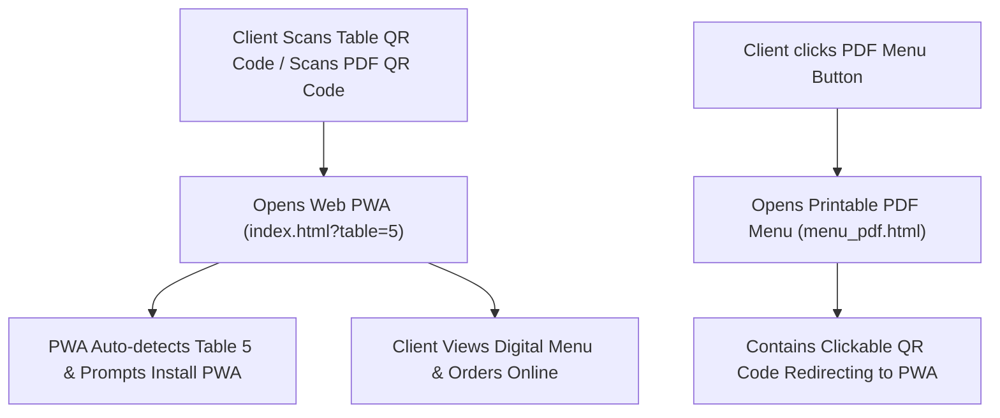

# Implementation Plan - PWA Instant Access: Table QR Codes & Printable PDF Menu

Provide cafe clients with frictionless access to the Favorite Cafe web PWA via:
1. **Scannable Table QR Codes**: Instant smartphone camera scanning that opens the PWA and auto-detects table numbers.
2. **Printable PDF Menu (`menu_pdf.html`)**: A clean, printable PDF menu featuring live dishes & prices, complete with an embedded QR code that redirects customers straight to the interactive web PWA.

---

## Proposed Solution Architecture

---

## User Review Required

> [!IMPORTANT]
> - The QR code generator automatically uses your domain URL (`http://localhost/favorite_cafe/` or published domain e.g. `https://favoritecafe.rw`).
> - The PDF menu will automatically sync live dishes and prices directly from `api/menu.php` / `menu.json`.

---

## Proposed Changes

### 1. Printable PDF Menu Generator Page
#### [NEW] [menu_pdf.html](file:///c:/xampp/htdocs/favorite_cafe/menu_pdf.html)
- A print-optimized 2-page document with cafe header, categories, prices, items, and high-visibility QR code.
- Includes a **"Print / Download PDF"** button (`window.print()`) that formats cleanly to A4 paper.
- The embedded QR Code & footer link redirect back to `index.html`.

---

### 2. QR Code Generator & Table Stand Maker in Admin
#### [MODIFY] [admin.html](file:///c:/xampp/htdocs/favorite_cafe/admin.html) & [js/admin.js](file:///c:/xampp/htdocs/favorite_cafe/js/admin.js)
- Add a **"Generate Table QR Stand"** modal in the Admin Dashboard.
- Allows selecting Table Number (e.g., Table 1 to 20) or Main Entrance QR.
- Renders printable Table Tent Cards with QR code: *"Scan to View Menu & Order from Table 5"*.

---

### 3. Customer Front-End Navigation & PWA Auto-Detection
#### [MODIFY] [index.html](file:///c:/xampp/htdocs/favorite_cafe/index.html) & [js/main.js](file:///c:/xampp/htdocs/favorite_cafe/js/main.js)
- Add **"📄 Download PDF Menu"** button to the top navigation bar and footer.
- Add URL parameter detection (`?table=5`): Automatically selects Table 5 in the table reservation / ordering modal when scanned from a table QR code.

---

## Verification Plan

### Automated / Syntax Verification
- Run PHP & JS syntax checks on `menu_pdf.html`, `js/admin.js`, and `js/main.js`.

### Manual Verification
- Test QR code generation for Table 1 through 20.
- Scan QR code via camera/URL to verify instant redirect to `index.html?table=X`.
- Open `menu_pdf.html` and click **Print / Save as PDF** to verify A4 layout and embedded QR code link.
