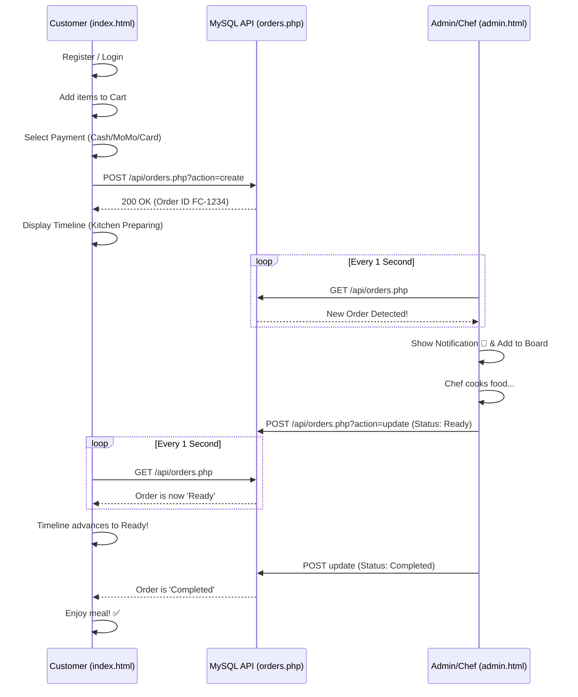

    

    <h1 style="font-family: 'Amatic SC', cursive; font-size: 3.2rem; color: #442406; text-transform: uppercase; letter-spacing: 2px; margin: 0;">Order Lifecycle Design</h1>
    
End-to-End Flow from Customer Cravings to Kitchen Fulfillment

    <h3 style="color: #d8745d; border-bottom: 2px dashed #aa7262; padding-bottom: 10px; margin-bottom: 20px;">
        <i class="fas fa-mobile-alt me-2"></i> 1. The Customer Journey
    </h3>
    <ul style="list-style: none; padding-left: 0;">
        <li style="margin-bottom: 15px;">
            <strong>1 Registration & Login:</strong> 
            The customer enters the app. New users register via a quick form (Name, Phone, Email) backed by local storage or a `users` DB table. Returning users log in to see their past history and saved addresses.
        </li>
        <li style="margin-bottom: 15px;">
            <strong>2 Menu Discovery & Order Placement:</strong> 
            Browsing the dynamic database-driven menu (styled like our PDF menu), the customer adds items to the cart. They proceed to checkout, selecting Dine-In, Takeaway, or Delivery.
        </li>
        <li style="margin-bottom: 15px;">
            <strong>3 Payment & Receipt:</strong> 
            Customer selects Cash, Card, or Mobile Money (MoMo). Upon submission, a unique Order ID (e.g., <code>FC-3825</code>) is generated. A digital receipt is shown and optionally sent via SMS/Email. The order goes live in the DB.
        </li>
        <li style="margin-bottom: 15px;">
            <strong>4 Real-Time Tracking:</strong> 
            The customer views a live timeline (Order Placed ➔ Preparing ➔ Ready/Dispatch ➔ Completed) that auto-updates without refreshing the page.
        </li>
    </ul>

    <h3 style="color: #d8745d; border-bottom: 2px dashed #aa7262; padding-bottom: 10px; margin-bottom: 20px;">
        <i class="fas fa-concierge-bell me-2"></i> 2. The Kitchen / Admin Fulfillment
    </h3>
    <ul style="list-style: none; padding-left: 0;">
        <li style="margin-bottom: 15px;">
            <strong>A Order Received:</strong> 
            The <code>admin.html</code> dashboard silently polls for new DB orders. When <code>FC-3825</code> hits the DB, the system flashes a notification and injects the ticket into the "Live Orders Dispatch" board. Default status: <em>Kitchen Preparing</em>.
        </li>
        <li style="margin-bottom: 15px;">
            <strong>B Chef Progression (Status Update):</strong> 
            The Chef uses the inline dropdown to advance the status to <em>Ready for Delivery</em>. This fires an update query to the DB.
        </li>
        <li style="margin-bottom: 15px;">
            <strong>C Dispatch & Completion:</strong> 
            Once the waiter/driver takes the food, the admin marks the order as <em>Completed</em>. The customer's tracker turns green, and the order is filed into the archives.
        </li>
    </ul>

    <h3 style="color: #442406; text-align: center; font-family: 'Amatic SC', cursive; font-size: 2.2rem;">System Architecture Diagram</h3>
    

